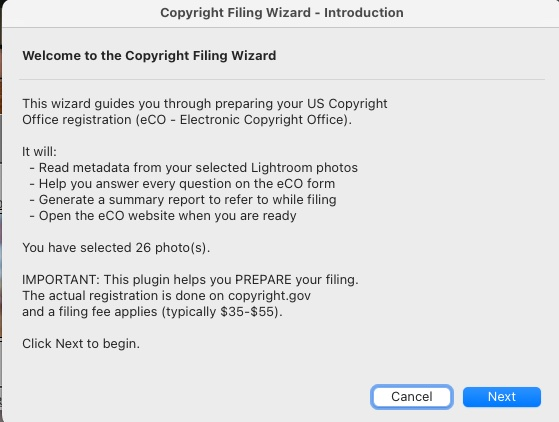
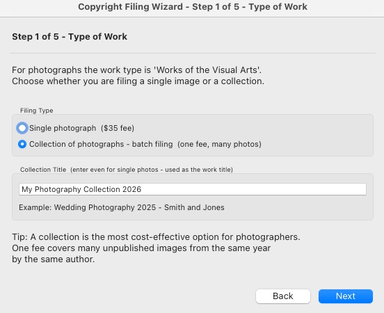
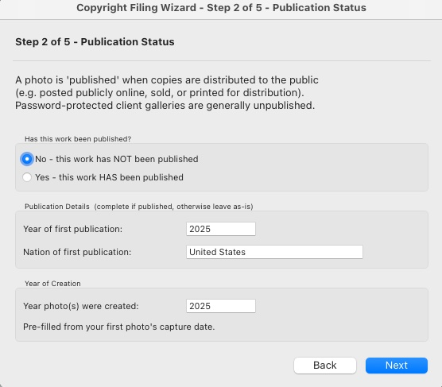
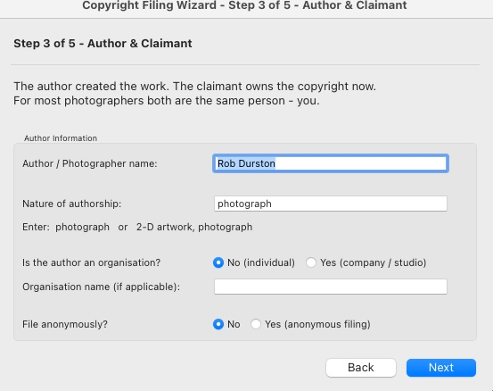
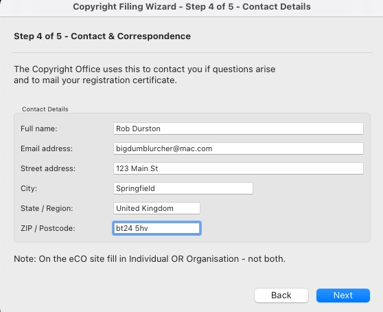
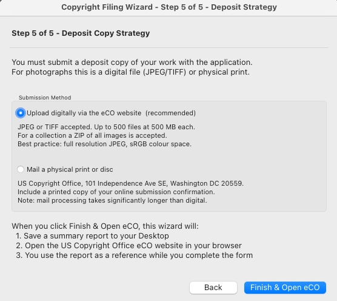
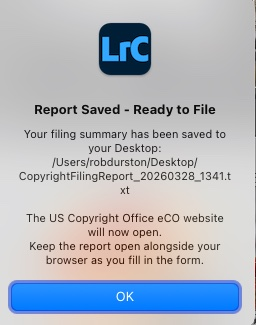
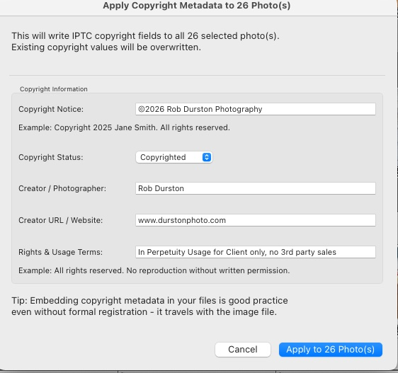
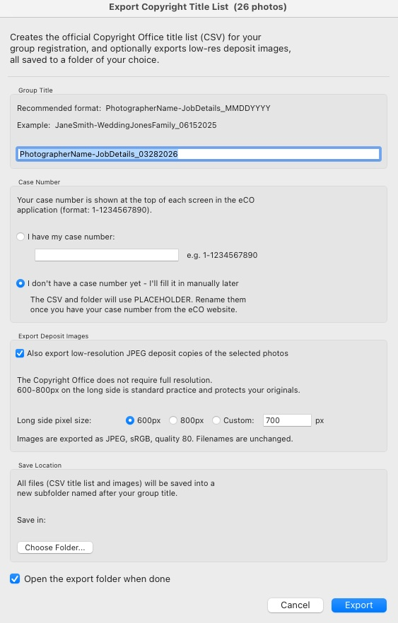

# Copyright Helper — US Copyright Registration Assistant for Adobe Lightroom Classic

**Copyright Helper** is a free, open-source Adobe Lightroom Classic plugin that guides photographers through registering their work with the US Copyright Office (eCO), generates the official title list spreadsheet, and exports low-resolution deposit images — all without leaving Lightroom.

Built by **[Rob Durston](https://www.belfastphotoworkshops.com)** & Claude (Anthropic) — [Belfast Photo Workshops](https://www.belfastphotoworkshops.com)

---

## Screenshots

[](screenshots/01_wizard_introduction.png)
*The Introduction screen — tells you how many photos are selected and what the wizard will do*

[](screenshots/02_wizard_step1_type_of_work.png)
*Step 1 — choose single photo or collection, and enter your group title*

[](screenshots/03_wizard_step2_publication_status.png)
*Step 2 — publication status and year of creation, pre-filled from your photo's capture date*

[](screenshots/04_wizard_step3_author_claimant.png)
*Step 3 — author information, pre-filled from your Lightroom IPTC Creator field*

[](screenshots/05_wizard_step4_contact_details.png)
*Step 4 — contact details for the Copyright Office correspondence and certificate mailing*

[](screenshots/06_wizard_step5_deposit_strategy.png)
*Step 5 — choose digital upload or physical mail for your deposit copy*

[](screenshots/07_wizard_report_saved.png)
*Finish — summary report saved to Desktop and eCO website opens automatically*

[](screenshots/08_apply_copyright_metadata.png)
*Apply Copyright Metadata — batch-write IPTC fields to any number of selected photos*

[](screenshots/09_export_title_list.png)
*Export Title List — generates the official Copyright Office CSV and exports low-res deposit images in one step*

---

## What It Does

Copyright Helper gives you three tools inside Lightroom's Library menu:

### 1. Copyright Filing Wizard
A step-by-step guided wizard that:
- Reads capture dates and creator info from your selected photos automatically
- Walks you through every question the eCO form will ask (work type, publication status, author, contact details, deposit method)
- Saves a summary report to your Desktop when you finish
- Opens the US Copyright Office eCO website in your browser, ready to file

### 2. Apply Copyright Metadata
- Batch-writes IPTC copyright fields to any number of selected photos in one click
- Fields include: copyright notice, copyright status, creator name, creator URL, and rights usage terms
- Pre-fills from existing metadata where available

### 3. Export Copyright Title List
Generates everything you need to submit your deposit in one go:
- The **official Copyright Office title list** (CSV) in the exact required format, with correct header rows and sequential numbering
- Optionally exports **low-resolution JPEG deposit copies** of your photos at 600px, 800px, or a custom size — protecting your full-resolution originals
- Lets you enter your **case number** (or use a placeholder if you haven't started your eCO application yet)
- **Choose Folder** button to save everything where you want
- All files saved into one neatly named folder, ready to upload

---

## Why Register Your Copyright?

You own the copyright to your photos the moment you press the shutter. But formal registration with the US Copyright Office gives you powerful legal benefits:

- **Statutory damages** of up to $150,000 per infringement (vs. only actual damages without registration)
- **Legal evidence** of ownership that instantly weakens any challenge
- Required before you can file a copyright infringement lawsuit in the US

Registration costs as little as $55 for a group of up to 750 photos.

---

## Requirements

- **Adobe Lightroom Classic** (version 5 or later)
- A **US Copyright Office eCO account** — free to create at [copyright.gov/eco](https://www.copyright.gov/eco/)
- A filing fee ($55 for a group of photographs)

No Python, no API key, no external dependencies. This plugin runs entirely within Lightroom.

---

## Installation

### Step 1 — Download the Plugin

Click the green **Code** button at the top of this page and choose **Download ZIP**. Unzip the file — you will find a folder named:

```
CopyrightHelper.lrplugin
```

### Step 2 — Place the Plugin Folder

Put the `CopyrightHelper.lrplugin` folder somewhere permanent on your computer:

**macOS (recommended):**
```
~/Documents/Lightroom Plugins/
```

**Windows (recommended):**
```
C:\Users\[YourName]\Documents\Lightroom Plugins\
```

### Step 3 — Add the Plugin in Lightroom

1. Open **Adobe Lightroom Classic**
2. Go to **File > Plug-in Manager...** (`Cmd+Shift+,` on Mac / `Ctrl+Shift+,` on Windows)
3. Click **Add** in the bottom-left corner
4. Navigate to and select the `CopyrightHelper.lrplugin` folder
5. Click **Add Plug-in**
6. The plugin should appear with a green dot — **Installed and running**
7. Click **Done**

### Step 4 — Confirm Installation

Go to the **Library** menu. You should see three new items:
- Copyright Filing Assistant...
- Apply Copyright Metadata to Selected Photos
- Export Copyright Title List (CSV)...

---

## Usage

### Filing Wizard

1. Select the photo(s) you want to register in the Library module
2. Go to **Library > Copyright Filing Assistant...**
3. Follow the 5-step wizard — your metadata is pre-filled where possible
4. Click **Finish & Open eCO** — your summary report is saved to your Desktop and the eCO website opens in your browser

### Apply Copyright Metadata

1. Select photos in the Library module
2. Go to **Library > Apply Copyright Metadata to Selected Photos**
3. Review and edit the pre-filled fields
4. Click **Apply to [N] Photo(s)**
5. To embed the metadata into the actual files: **Metadata > Save Metadata to File** (`Cmd+S` / `Ctrl+S`)

### Export Copyright Title List

1. Select the photos for your registration group (max 750 per application)
2. Go to **Library > Export Copyright Title List (CSV)...**
3. Fill in:
   - **Group Title** — e.g. `JaneSmith-WeddingJonesFamily_06152025`
   - **Case Number** — enter it if you already have one, or choose "I'll fill it in later"
   - **Export Deposit Images** — tick to export low-res JPEGs at the same time (600px, 800px, or custom)
   - **Save Location** — click Choose Folder to pick where everything is saved
4. Click **Export**

Your output folder will contain:
```
JaneSmith-WeddingJonesFamily_06152025 Case Number 1-1234567890/
    JaneSmith-WeddingJonesFamily_06152025 Case Number 1-1234567890.csv
    deposit_images/
        IMG_0001.jpg
        IMG_0002.jpg
        ...
```

---

## Filing on the Copyright Office Website

After running the wizard, use your summary report as a reference while completing the eCO form at [copyright.gov/eco](https://www.copyright.gov/eco/):

1. Log in and click **Register a New Claim**
2. Select the group registration option:
   - **GRUPH** — Group Registration for Unpublished Photographs
   - **GRPPH** — Group Registration for Published Photographs
3. Follow the form using your summary report
4. After payment, upload your deposit images and title list CSV
5. Enter the CSV filename in the certification screen
6. Click **Complete Your Submission** and save your case number

---

## Fees & Processing Times

| Filing Type | Fee | Processing Time |
|-------------|-----|----------------|
| Group of unpublished photographs (GRUPH) | $55 | ~8 months |
| Group of published photographs (GRPPH) | $55 | ~8 months |
| Single work, one author | $35 | ~8 months |
| Paper application | $85 | ~13 months |
| Special handling (urgent) | $800 | ~5 business days |

Fees are set by the Copyright Office and may change. Check current fees at [copyright.gov/about/fees.html](https://www.copyright.gov/about/fees.html).

---

## Key Facts for Photographers

- **Group limit:** Up to **750 photographs** per application. Split larger sets into groups ("Group 1 of 2" etc.)
- **Published vs unpublished:** A group cannot mix both — all photos must be the same. Published groups must all be from the same calendar year.
- **Deposit image size:** The Copyright Office does **not** require full resolution. 600–800px on the long side is standard practice and protects your originals.
- **File before publishing:** You can only claim statutory damages if you registered before the infringement, or within 3 months of first publication.

---

## Privacy

This plugin runs entirely within Lightroom and does not send any data to external servers. No photos, metadata, or personal information leave your computer. Your data is only submitted when you choose to file directly on the Copyright Office website.

---

## Contributing

Contributions are welcome! If you find a bug, have a feature request, or want to improve the plugin, please open an issue or submit a pull request.

Ideas for future development:
- Auto-detect published/unpublished status from IPTC fields
- Save and recall photographer profile (name, address, email) between sessions
- Batch splitting of large selections into groups of 750
- Windows installer / setup guide

---

## Support a Good Cause

If this plugin has been useful to you, please consider making a donation to **Lucy's Trust**, a charity supported by the author.

| Location | Donation Link |
|----------|--------------|
| International | [paypal.me/lucystrust](https://www.paypal.me/lucystrust) |
| United Kingdom | [justgiving.com/charity/lucystrust](https://www.justgiving.com/charity/lucystrust) |

Thank you for your support.

---

## Licence

This project is released under the **MIT Licence** — free to use, modify, and distribute.

---

## Acknowledgements

- Built with the [Adobe Lightroom Classic SDK](https://developer.adobe.com/lightroom/)
- Copyright Office filing guidance from [copyright.gov](https://www.copyright.gov)

---

*Made with ☕ and AI by [Rob Durston](https://www.belfastphotoworkshops.com) & Claude — [Belfast Photo Workshops](https://www.belfastphotoworkshops.com)*
